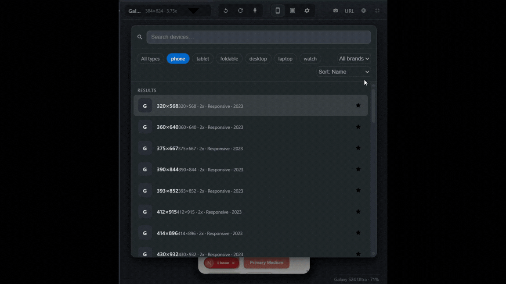
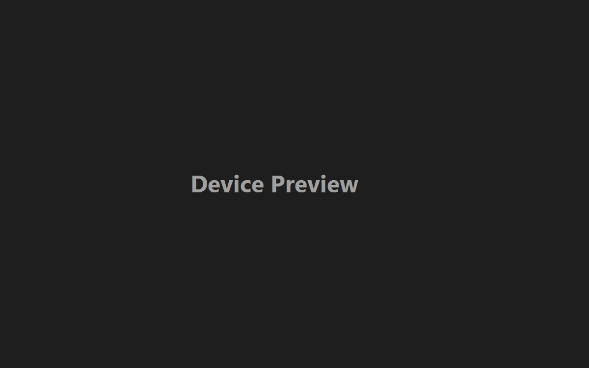

# PocketView

**Your app, in your pocket, inside VS Code.**

PocketView renders your web app live in a realistic phone, tablet, or watch
frame — right next to your code. It finds the dev server that belongs to *your
workspace* (even with several servers running), reloads as you type, and
captures pixel-perfect screenshots at real device resolution.




## Why PocketView?

- **It shows *your* project, always.** PocketView matches listening ports to
  the process that owns them and only connects to servers started from your
  workspace folder. When Vite hops from 5173 to 5174 because another project
  took the default port, PocketView follows *your* server — it never silently
  renders someone else's app.
- **Real device geometry.** Bezels, rounded corners, notch / Dynamic Island /
  punch-hole cameras, hardware buttons, home indicator, and safe-area guides —
  all drawn from per-device data, in portrait and landscape.
- **Zero setup.** Install, run `npm run dev`, open PocketView. Done.

## Features

| | |
| --- | --- |
| 📱 **Device library** | iPhones, iPads, Pixels, Galaxies, foldables, laptops, desktops, and watches — searchable picker with favorites and recents |
| 🔍 **Workspace-aware detection** | Connects only to dev servers owned by your workspace; clear diagnostics when none is found |
| ♻️ **Live reload** | Watches your source files and reloads the preview — but defers to your framework's HMR (Vite, Next, Nuxt, webpack) when available |
| 🔄 **Rotate** | Portrait ⇄ landscape with correct notch and safe-area placement |
| 🔎 **Zoom** | 25–200% presets, Fit-to-Panel, and Ctrl+wheel / trackpad pinch |
| 🧭 **Route tracking** | Knows which page you're on inside your app — shown live in the status bar and used as the screenshot default |
| 📸 **Screenshots** | Captured by an invisible headless Chromium at the device's exact viewport, pixel ratio, and user agent — optionally composited into the device frame |
| 🎨 **Native feel** | Theme-aware UI, status bar item, keyboard shortcuts, accessible controls |



## Getting started

1. **Install** PocketView (Marketplace, or `code --install-extension pocketview-1.0.0.vsix`).
2. **Start your dev server** in the workspace you want to preview, e.g. `npm run dev`.
3. Open the Command Palette (<kbd>Ctrl/Cmd</kbd>+<kbd>Shift</kbd>+<kbd>P</kbd>) →
   **PocketView: Show Preview**, or click the **📱 PocketView** status bar item.

PocketView detects the server that belongs to your workspace and shows your app
in the selected device. The resolved URL appears in the panel tab title
(e.g. `PocketView — localhost:5174`) and in the preview's status bar, so you can
always see exactly what you're looking at.

### If no server is detected

PocketView deliberately refuses to guess: if it can't verify that a running
server belongs to your workspace, it says so instead of showing a random app.
Your options:

- Click **Connect to URL…** and enter the address, or
- Pin it permanently in `.vscode/settings.json`:

  ```json
  { "pocketView.url": "http://localhost:5174" }
  ```

- Check **View → Output → PocketView** for a full trace of every port it
  found and why each was accepted or rejected.

## Commands

| Command | Description |
| --- | --- |
| `PocketView: Show Preview` | Open (or focus) the preview panel |
| `PocketView: Refresh` | Reload the preview |
| `PocketView: Rotate Device` | Toggle portrait / landscape |
| `PocketView: Next / Previous Device` | Cycle through devices |
| `PocketView: Capture Screenshot` | Save a PNG of the current device |
| `PocketView: Connect to URL` | Preview a specific URL |
| `PocketView: Toggle Fullscreen` | Hide the toolbar and status bar |

### Keyboard shortcuts

When the panel is focused:

| Shortcut | Action |
| --- | --- |
| <kbd>Ctrl/Cmd</kbd>+<kbd>Alt</kbd>+<kbd>R</kbd> | Refresh |
| <kbd>Ctrl/Cmd</kbd>+<kbd>Alt</kbd>+<kbd>O</kbd> | Rotate |
| <kbd>Ctrl/Cmd</kbd>+<kbd>Alt</kbd>+<kbd>→ / ←</kbd> | Next / previous device |
| <kbd>R</kbd> / <kbd>F</kbd> / <kbd>→</kbd> / <kbd>←</kbd> | Rotate / fullscreen / cycle devices (inside the preview) |
| <kbd>Ctrl</kbd>+wheel | Pinch-zoom the device frame |

## Settings

| Setting | Default | Description |
| --- | --- | --- |
| `pocketView.url` | `""` | **Pin the preview to this exact URL** — overrides all detection. Set per workspace |
| `pocketView.defaultDevice` | `iphone-15-pro` | Device shown on open |
| `pocketView.defaultZoom` | `fit` | `25`–`200` (percent) or `fit` |
| `pocketView.autoDetect` | `true` | Workspace-aware dev-server detection |
| `pocketView.autoRefresh` | `true` | Reload the preview on file changes |
| `pocketView.routeTracking` | `true` | Serve the preview through a local helper proxy so PocketView knows which page you're on |
| `pocketView.defaultURL` | `""` | Fallback URL when nothing is detected |
| `pocketView.customPorts` | `[]` | Extra ports to consider |
| `pocketView.rememberLastServer` | `true` | Prefer the last connected server |
| `pocketView.defaultOrientation` | `portrait` | `portrait` or `landscape` |
| `pocketView.showStatusBar` | `true` | Show the 📱 status bar item |
| `pocketView.screenshot.includeFrame` | `false` | Composite the device bezel into screenshots |

## How server detection works

1. `pocketView.url`, if set — explicit pin, always wins.
2. **Workspace-owned servers**: PocketView lists listening TCP ports, resolves
   each owning process (PowerShell CIM on Windows, `lsof`/`ps` on macOS and
   Linux), and keeps only processes launched from inside your workspace folder.
   If several match, the most recently started wins.
3. Explicit config: `customPorts`, then `defaultURL`.
4. If ownership can't be inspected on your system, PocketView falls back to a
   port scan and clearly labels the connection **unverified**.

Every step is logged to the **PocketView** output channel for easy diagnosis.

## Route tracking

Your app runs in a cross-origin iframe, which browsers sandbox — the webview
can't see which page you've navigated to. To fix that, PocketView serves the
preview through a **tiny local proxy** that forwards everything to your dev
server (HMR WebSockets included) and injects a one-line reporter into your
app's HTML. Your app then tells PocketView its current route on every
navigation — pushState, hash changes, and back/forward all included.

The result: the current route shows live in the status bar (e.g.
`localhost:5174` **`/login`**), and screenshots default to the exact page
you're looking at. This is on by default; turn it off with
`pocketView.routeTracking: false` if your app misbehaves behind the proxy (the
preview still works — you just lose route awareness).

## Screenshots & cross-origin honesty

Screenshots are captured by a **headless (invisible) Chromium** — reusing your
installed Chrome or Edge — at the device's true viewport, pixel ratio, and user
agent, then optionally composited into the device frame. No browser window ever
opens.

Because the capture starts a **fresh browser session**, PocketView asks which
page to capture — but thanks to route tracking, the prompt is **prefilled with
the page you're currently viewing**, so it's usually just a keystroke to
confirm. You can also type any route (`/login`, `#/dashboard`) or a full URL.
Pages that require you to be logged in will capture as a signed-out visitor
would see them.

## Development

```bash
npm install
npm run build      # extension host + webview bundles
npm test           # unit + webview tests (Vitest)
npm run lint       # ESLint, zero warnings
npm run package    # produce the .vsix
```

Press <kbd>F5</kbd> in VS Code to launch the Extension Development Host.
Use `npm run watch` for incremental rebuilds.

Devices are plain data — adding one is a single entry in
`src/shared/devices/catalog/` with no rendering code. See
[CONTRIBUTING.md](CONTRIBUTING.md).

## License

[MIT](LICENSE)
